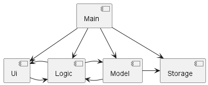
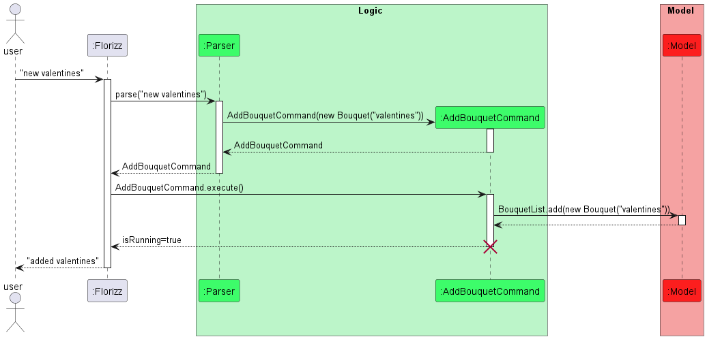
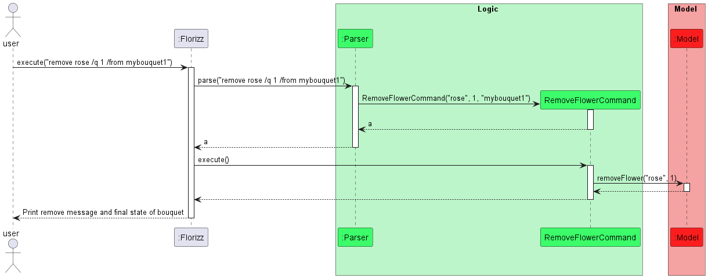
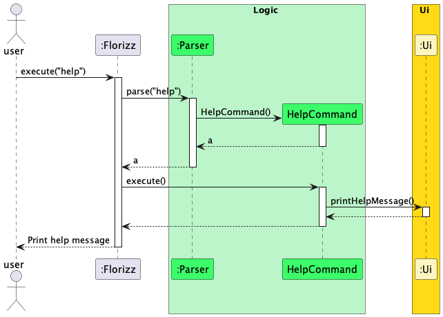

# Developer Guide

## Acknowledgements

{list here sources of all reused/adapted ideas, code, documentation, and third-party libraries -- include links to the original source as well}

## Design
Florizz consists of four components, Ui, Logic, Model and Storage. These components are all called on by the Main component, Florizz.java, which simply handles the app initialisation.

App initialisation: Initialises the various components, then begins reading inputs from the user

`Ui`: takes in user inputs from the CLI and sends it to the Logic component. Also handles all writing of messages to the user

`Logic`: takes in string input from Ui, and parses it into commands to be executed on variables stored in the model. Calls Ui to provide the user with feedback that the action has or has not been completed.

`Model`: Handles all the cached variables, i.e. the list of Bouquets created by the user, the list of available Flowers that the user can add to their Bouquets

`Storage`: Handles storing and reading from hardware, such as saving the list of bouquets created by the user so they can access it later.

## Implementation

### Adding/Removing Bouquets

To add a new bouquet to the list of Bouquets saved in the BouquetList variable, the user would have to type `add <bouquet name>` into the CLI, which is then handled by `Ui.getInput` and passed to `Parser`, which 
creates a Command `Addcommand` with a new Bouquet of that name as an argument. This command is then sent back to `Florizz`, the main class, where it is then executed. 

If a bouquet of the same name already exists in BouquetList, an exception will be thrown and the user will be prompted to choose another name. This is facilitated by overriding the .equals() method in the `Bouquet` class such that
when two Bouquets are compared, .equals() returns true when they have the same name, regardless of which flowers are contained within each `Bouquet`. This decision was made mainly to facilitate `DeleteBouquetCommand`, 
so we can simply call BouquetList.remove(BouquetToRemove) and the correct bouquet will be removed even if the BouquetToRemove is simply an empty `Bouquet` with the same name as the one in the list.

After adding the `Bouquet` to `BouquetList`, the new `Bouquet` is then sent to `ui.printBouquetAdded`, where a confirmation message will be printed to the user. 

Removing Bouquets follows a similar logic, just that instead of calling `BouquetList.add(Bouquet)`, executing `DeleteBouquetCommand` calls `BouquetList.remove(Bouquet)`, removing the `Bouquet` as mentioned above.

### Flower Information Command

`info <flowerName>` command prints information about the specified flower

Step 1: Flower information mechanism utilize the `parser` class to parse user command for a specific flower name inputted.

Step 2: Once `parser` detect that `info` keyword is used, it will instantiate `InfoCommand` class and run its `execute()` method.

Step 3: `InfoCommand` class will call `printFlowerInfo()` method of `Ui` class

Step 4: `get()` of `FlowerDictionary` class will then be called in order to retrive information about the specified flower. This information will be printed by the `Ui` class

### Flower Remove Command

`remove <flowerName> /q <quantity> /from <bouquetName>` removes flower(s) from a bouquet

;

Removing flowers utilise the `parser` class to parse user command to identify which flower to remove,
how much to remove and from which bouquet to remove.

**Step 1:** User will input the flower name, quantity and bouquet name into the `Parser.parser()` method, after which `RemoveFlowerCommand`
class will be instantiated and run its `execute()` method.

**Step 2:** An object of type `RemoveFlowerCommand` is returned which contains the name, quantity of the flower to be added, and the target bouquet

**Step 3:** Within the `RemoveFlowerCommand`, `execute()` method is called to execute the removal of flower command

**Step 4:** The flowers are removed and a confirmation message is sent back to the user

### Flower Help Command

`help` Shows a list of valid commands

;

Help command utilises the `parser` class to identify the keyword `help`

**Step 1: ** User will write `help` and `HelpCommand` class will be instantiated and `execute()` method will run.

**Step 2:** `HelpCommand` class will call `printHelpMessage()` method of `Ui` class

**Step 3:** The list of valid commands will be printed by the `Ui` class

### Add Flower Command

`add <flower> /q <quantity> /to <targetBouquet>` command adds specified number of flower to a bouquet

Step 1: Firstly the input is put into the `Parser.parse()` method to identify that it is infact an add flower command.

Step 2: Then an object of type `AddFlowerCommand` is returned which contains the name, quantity of the flower to be added, as well as the target bouquet

Step 3: The `execute()` method is called to execute the add flower command 

Step 4: The target bouquet, which is under model, is updated accordingly

Step 5: A confirmation message is then sent back to the user

### [Proposed] Storage

#### Proposed Implementation:

The proposed storage mechanism will utilize a class `storage` who is in charge of getting the file, `encoder` which will encode current model into a .txt file format, `decoder` which will decode .txt file into a usable model.

#### Design Considerations:
- Alternative 1 (current choice): use .txt files as storage
    - Pros:
        - Easier to implement
        - .txt file is very readable even outside of programme
    - Cons:
        - .txt file can be easily changed outside of programme, making storage of model prone to parsing failure
- Alternative 2: use .csv files as storage
    - Pros:
        - A more standardize format that is easily accepted by other 3rd party software
    - Cons:
        - More difficulty to set up the decoder
        - .csv file can be easily changed outside of programme, making storage of model prone to parsing failure

# Appendix: Requirements

## Product scope

### Target user profile:
- has a need of purchasing a bouquet
- prefers desktop apps over other types
- can type reasonably fast
- prefers typing to mouse interactions
- is comfortable using CLI apps

### Value proposition:
- organise flowers faster than using a GUI driven app
- curate flowers automatically based on context given through typed text

## User Stories
Priorities: High (must have) `* * *`, Medium (nice to have) `* *`, Low (unlikely to have) `*`

| No  | As a ...        | I can ...                                        | So that I can ...                                                             | Priority |
|-----|-----------------|--------------------------------------------------|-------------------------------------------------------------------------------|----------|
| 1   | first-time user | see an intro message detailing a command flow    | easily know what commands to type                                             | ***      |
| 2   | user            | add flowers into my list                         | easily manage the list                                                        | ***      |
| 3   | user            | remove flowers from my list                      | update my list of flowers                                                     | ***      |
| 4   | user            | navigate a list of flowers                       | easily know what flowers to add to my bouquet                                 | ***      |
| 5   | user            | specify the occasion I am buying flowers for     | get suggestion on appropriate flowers to buy without wasting time researching | ***      |
| 6   | user            | make new bouquets                                | make multiple bouquets for different occasion                                 | ***      |
| 7   | advanced user   | see detailed information of each flower          | be more knowledgeable in the flowers I buy                                    | **       |
| 8   | user            | save my bouquets to hardware                     | view it for a later date                                                      | **       |
| 9   | user            | export my list of flowers to readable files      | save and share it externally                                                  | **       |     
| 10  | advanced user   | mix and match flowers manually                   | have a customised bouquet                                                     | **       |
| 11  | user            | filter flowers based on colours                  | add matching flowers into my bouquet                                          | **       |
| 12  | first-time user | type `help` for usage of command                 | better use the app                                                            | **       |
| 13  | user            | view an image of specified flower                | better visualise how the bouquet will look like                               | **       |
| 14  | user            | calculate the approximate cost of bouquets       | better budget my bouquet                                                      | *        |
| 15  | user            | ask how to prepare bouquets                      | make my own bouquets from flowers I bought                                    | *        |
| 16  | user            | view locations of flower shops around me         | buy fresh flower conveniently                                                 | *        |

## Use cases

(For all all use cases below, the System is `Florizz` and the Actor is the `user`, unless specified otherwise)

**Use case: Create a new bouquet named "for valentine" and add 3 stalks of rose into the bouquet**

Main Success Scenario (MSS):
1. User creates new bouquet named "for valentine"
2. Programme responds that a new bouquet is successfully created
3. User adds 3 stalks of rose into the bouquet
4. Programme responds that the 3 stalks of rose has been successfully added
5. Programme displays the current state of "for valentine" bouquet and all the flowers inside it

** Use case: Removing flowers from a bouquet named "for valentine" **

Main Success Scenario (MSS):
1. User removes 5 stalks of rose from the bouquet named "for valentine"
2. Programme responds that 5 stalks of rose from the specified bouquet successfully
3. Programme displays the current state of "for valentine" bouquet and all the flowers inside it

**Extensions**
- 1a. The bouquet named "for valentine" does not exist
    - 1a. Florizz shows an error message

      Use case ends.

- 2a. There are less than 5 stalks of rose in the specified bouquet
    - 2a1. Florizz shows an error message

      Use case ends. 